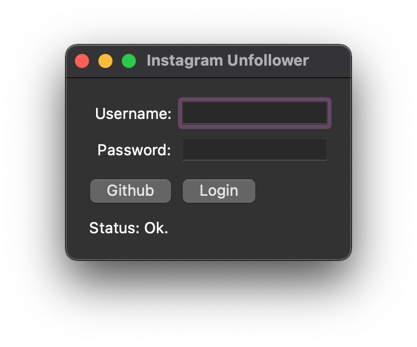
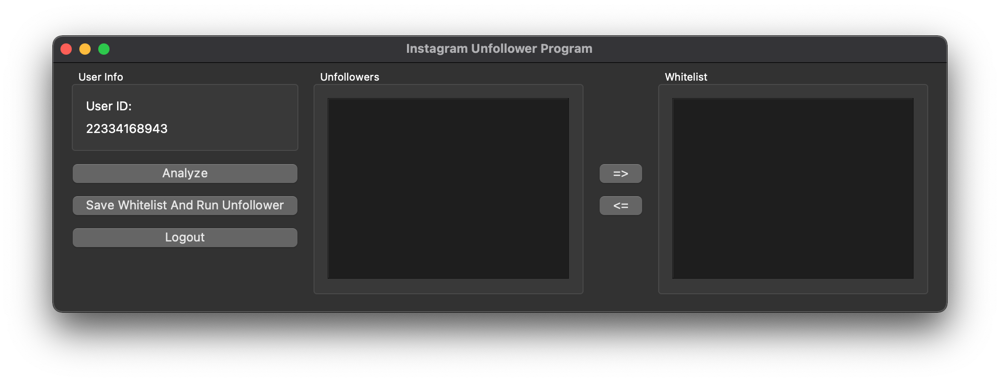

# Instagram Unfollower
It is a simple application that unfollows those who don't follow you using [instagram_private_api](https://github.com/ping/instagram_private_api). With the code I wrote, we can use this API with the interface.

## How to use?
To use it, you must first install the requirements. To install the requirements, open your Terminal or Console in your project directory and run the command below.
    
```bash 
pip install -r requirements.txt
```

After running this command, you can directly type ``python3 main.py`` into your terminal and run it.

## Screenshots



## Known Problems
* Getting an error when logging into an account with 2FA enabled. (Therefore, you should temporarily turn off 2FA protection while using the application.)
* Error dialog does not work.(It forces the application to quit, giving error information directly to the console.)
* After logging in, it kicks from the application instead of showing the main window.

Also tested on macOS only.

## WARNING ⚠️
I do not accept any responsibility for any errors that may occur due to the use of the application or the codes. I made this app just to try it myself.